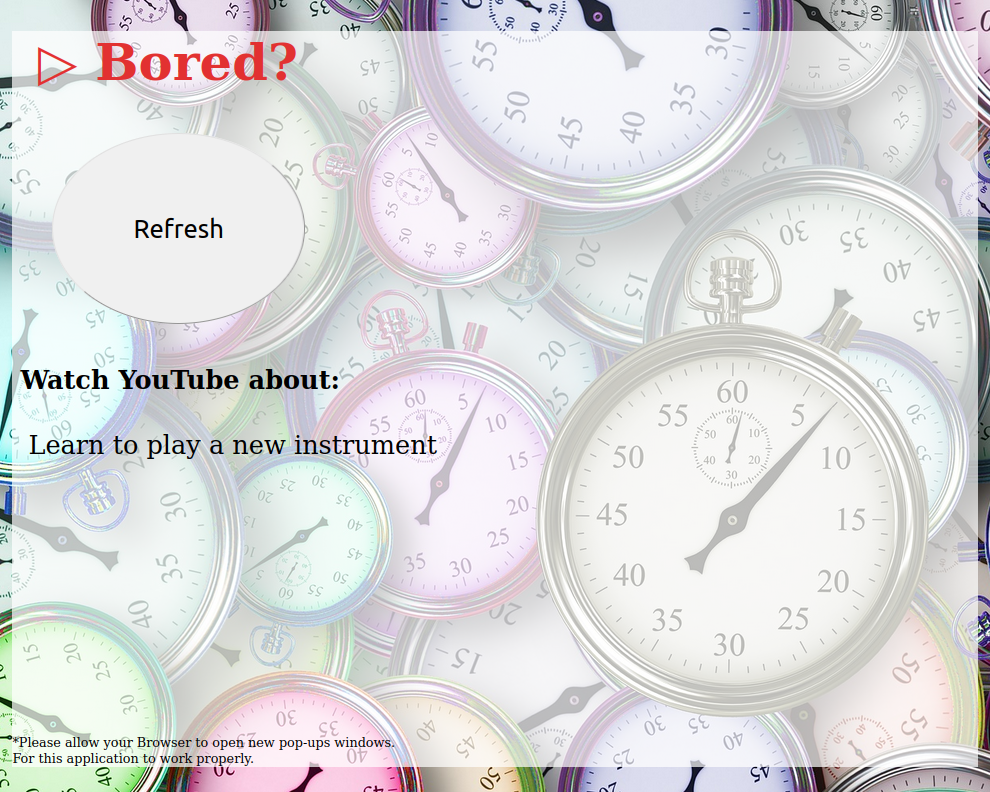

# 0004-if-bored-then-watch-videos
**This is an application that will generate new ideas of activities to learn about**

Have you evern been bored?  
And you didn't know what to do or what video to watch on YouTube..?  
No problem, this App solves that problem by generating new ideas and new activities that you can watch YouTube videos about.  

For this to work I used:  
- Bored API http://www.boredapi.com/
- And for each activity I will open a new YouTube tab in the browser
- Used JavaScript, SASS, HTML, CSS

